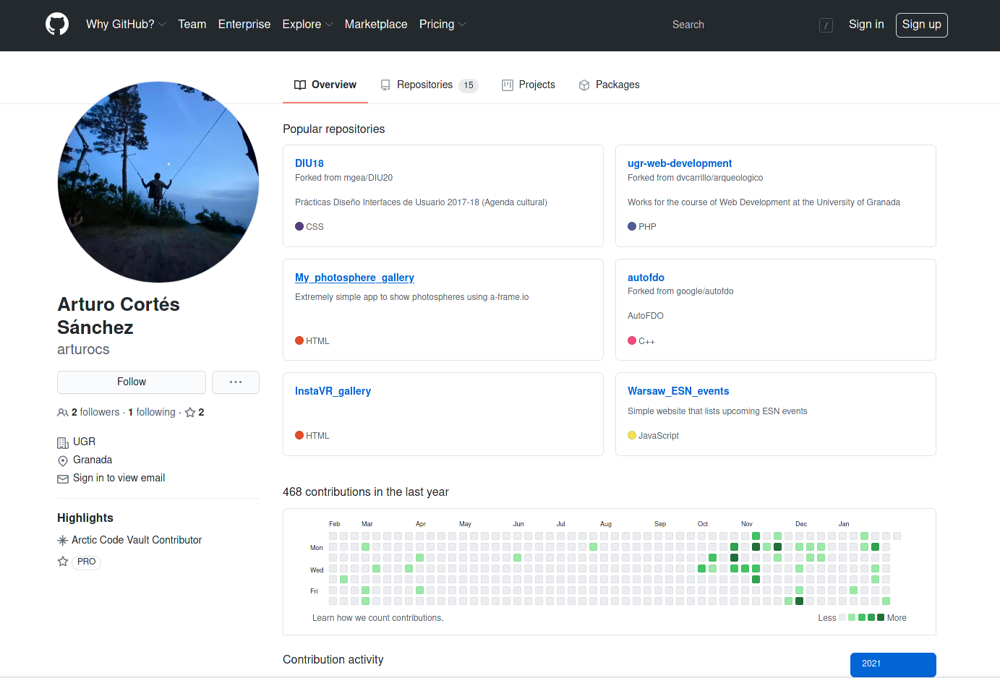
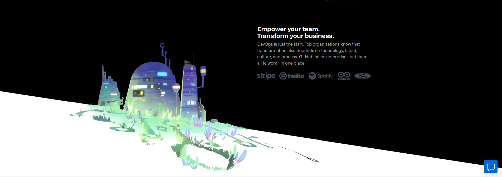
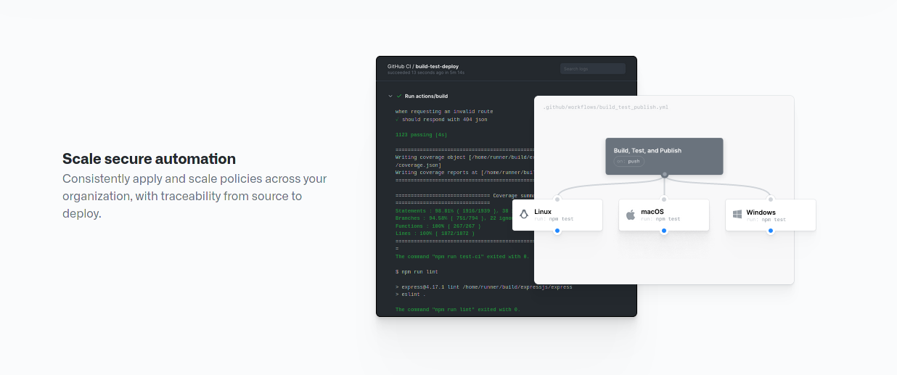

## Analizar una página web o una aplicación móvil para ver si se han seguido las “leyes de gestalt” y poner ejemplos de su uso en ella.

**Por: Arturo Cortés Sánchez**

He elegido Github para este ejercicio.

### Proximidad:

En la parte de https://lab.github.com/ podemos ver como se cumple el principio de proximidad. Los bloques se agrupan en filas, cada una correspondiente a una categoría.

### Similaridad:

Podemos ver como en la página de perfil de cualquier usuario, los repositorios populares cumplen el principio de similaridad gracias la distinción entre lenguajes de programación.

### Buena Continuidad:

No he encontrado ningún elemento que cumpla este principio.

### Cerramiento:

La linea de separación de secciones hace a la vez de superficie en la que se sitúa ese edificio.

### Figura / Fondo:

Esta sección de la página principal simula tiene unas imágenes de unas ventanas, las cuales utilizan la organización de figura fondo.

### Rodear

La imagen de la izquierda cumple el principio de rodear, por dentro vemos el logo de github, por fuera una ciudad.

### Área / Pequeño:

En esta parte de la página principal vemos como multiples rectangulos pequeños sobresalen del rectángulo de fondo que es una ventana.

### Simetría:

La sección de repositorios populares mantiene el principio de simetría.

### Pregnancia o equilibrio

Podemos ver como cada bloque se contiene elementos de menor tamaño fácilmente perceptibles.