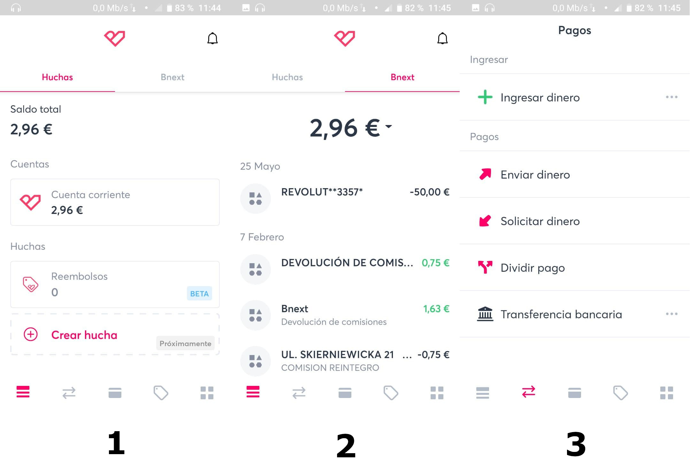
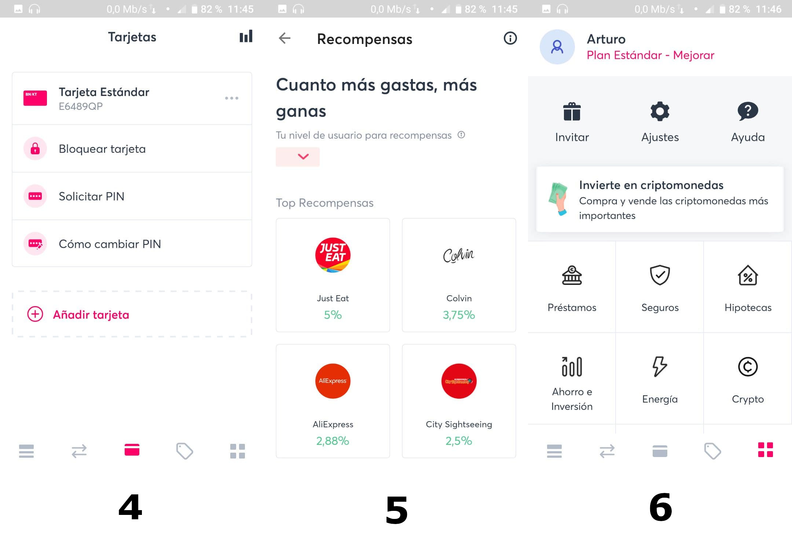

# Ejercicio Seminario 5: Navegación

**Por: Arturo Cortés Sánchez**

### Usar la aplicación móvil que tenga tu banco y analízala desde el punto de vista de la estructura y la navegación.

He seleccionado la aplicación de Bnext ya que es la única aplicación bancaria que tengo que sigue patrones material design.

Se trata de una aplicación dirigida por la navegación ya que como podemos ver en la primera imagen, la pantalla inicial es una vista de alto nivel que consta del saldo restante, una bottom navigation bar y un par de pestañas arriba.

En la segunda imagen podemos ver que se muestra una lista de las ultimas transacciones realizadas con la tarjeta. La captura número cinco muestra lo que podría considerarse una pantalla de publicidad integrada en la App, y el resto de capturas muestran distintas opciones o servicios.

En todas las capturas menos la quinta podemos ver que la aplicación usa una bottom navigation bar, en las dos primeras se puede ver el uso de pestañas. En la segunda, tercera y cuarta imagen podemos ver que se hacen uso de listas, aunque en el caso de la tercera y cuarta, son listas de opciones. En la quinta imagen podemos ver como tenemos una lista de tarjetas