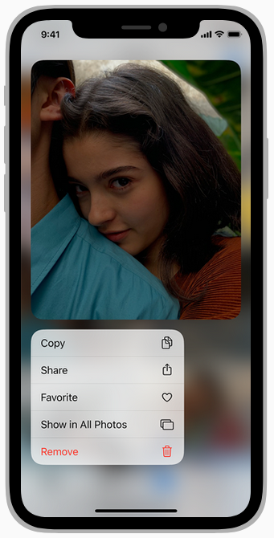

# Ejercicio Seminario 5: iOS

**Por: Arturo Cortés Sánchez**

1. ¿Qué sistema de navegación usa iOS para substituir a las pestañas de Android?

   Utiliza una bottom action bar que en el caso de iOS se llama Tab bar.

2. ¿Dónde colocarías los botones de acción de una AppBar en una aplicación para iOS?

   En las esquinas superiores, ya que las inferiores suelen estar pilladas por la bottom action bar.

   

3. ¿Tiene iOS algo similar a los FAB?

   En iOS 11 la aplicación oficial de notas tiene un boton muy similar a un FAB de android.

4. ¿Cómo diseñarías en iOS un menú contextual tipo “Floating Context Menu” de Android?

   iOS incluye su propia versión de los context menus 

5.¿Cómo propone iOS la selección múltiple de elementos en una lista?

​	Marcando los elementos de la lista con "checkmarks"

