# Práctica 2: Algoritmos genéticos

**Por: Arturo Cortés Sánchez**


## Índice

* [Introducción](#introducción)
* [Instrucciones](#instrucciones)
* [Implementación](#implementación)
  * [Optimizaciones del cálculo del coste](#optimizaciones-del-cálculo-del-coste)
    * [Eliminar partes innecesarias del problema](#Eliminar-partes-innecesarias-del-problema)
    * [No recalcular coste en el algoritmo greedy](#No-recalcular-coste-en-el-algoritmo-greedy)
    * [Evitar la comprobación de límites](#Evitar-la-comprobación-de-límites)
  * [Generación de la población inicial](#Generación-de-la-población-inicial)
  * [Funciones de evaluación](#Funciones-de-evaluación)
  * [Selección de supervivientes](#Selección-de-supervivientes)
  * [Selección de padres](#Selección-de-padres)
  * [Operador de cruce](#Operador-de-cruce)
  * [Operador de mutación](#Operador-de-mutación)
  * [Ejecución del algoritmo genético](#Ejecución-del-algoritmo-genético)
* [Comparativas y resultados](#Comparativas-y-resultados)
  * [Generaciones](#Generaciones)
  * [Población](#Población)
  * [Generador de población](#Generador-de-población)
  * [Número de padres](#Número-de-padres)
  * [Número de supervivientes e hijos](#Número-de-supervivientes-e-hijos)
  * [Probabilidad de mutación y máximo numero de mutaciones](#Probabilidad-de-mutación-y-máximo-numero-de-mutaciones)
  * [Mezcla genética](#Mezcla-genética)
  * [Mejor solución](#Mejor-solución)
* [Posibles mejoras](#Posibles-mejoras)
* [Conclusiones](#conclusiones)


## Introducción

En esta práctica se pide resolver el problema de la asignación cuadrática mediante algoritmos genéticos. Este problema se puede reducir encontrar un p que minimice la siguiente sumatoria:
$$
\sum_{i,j} w(i,j)d(p(i), p(j))
$$


Donde w y d son dos matrices que vienen en el archivo `tai256c.dat` de la biblioteca [QAPLIB](http://www.seas.upenn.edu/qaplib/). Estas dos matrices tienen cada una una peculiaridad que permite aplicar ciertas optimizaciones. El código desarrollado hace uso de estas optimizaciones y por tanto no es válido para otros archivos de [QAPLIB](http://www.seas.upenn.edu/qaplib/).

## Instrucciones

Para ejecutar este proyecto es necesario tener instalado el lenguaje de programación Rust. Se puede instalar siguiendo las [instrucciones oficiales](https://www.rust-lang.org/tools/install) o desde los repositorios de algunas distribuciones Linux. La versión mínima necesaria es la 1.43 y se ha comprobado que funciona en la última versión estable, a fecha de escritura la 1.50.

Una vez instalado Rust basta con ir a la carpeta raíz del proyecto y ejecutar:

```
cargo run --release
```

Si se quiere generar la documentación hay que ejecutar la siguiente linea:

```
cargo doc --no-deps --open
```


## Implementación

La práctica ha sido desarrollado en el lenguaje de programación Rust, un lenguaje compilado que gracias a sus peculiaridades permite paralelizar el código con bastante facilidad.

He hecho uso de las siguientes bibliotecas:

* [rand](https://crates.io/crates/rand): Rust no tiene generador de números aleatorios en su biblioteca estándar, así ha sido necesario usar esta biblioteca para generar la aleatoriedad característica de los algoritmos genéticos.

* [lazy_static](https://crates.io/crates/lazy_static): Esta biblioteca permite la creación de constantes globales que requieren llamar a una función para ser inicializadas. Su uso no es estrictamente necesario pero simplifica bastante el código, ya que la alternativa es continuamente pasar por referencia el struct.

* [rayon](https://crates.io/crates/rayon): Biblioteca de iteradores paralelos. Gracias a ella he podido paralelizar mi código y acelerar considerablemente su ejecución, pudiendo realizar mas pruebas y obteniendo mejores resultados.

* [rustc-hash](https://crates.io/crates/rustc-hash): El algoritmo de hashing de la biblioteca estándar de Rust está pensado para ser criptográficamente seguro, debido a esto funciona relativamente lento con números enteros. En el algoritmo genético básico esto termina causando un cuello de botella. Esta biblioteca provee un algoritmo de hashing no seguro pero que funciona bastante mas rápido además de una tabla hash y un hashset que hacen uso de él. Usando esta última estructura de datos la velocidad del algoritmo genético estándar mejora en casi un 40%.

* [derive_builder](https://crates.io/crates/derive_builder): Dado que mi algoritmo genético admite diez parámetros, he optado por utilizar el patron builder para hacer mas claro el código. Esta librería implementa automáticamente el patrón builder, eliminado así bastante boilerplate.

  

### Optimizaciones del cálculo del coste

#### Eliminar partes innecesarias del problema:

Observando el archivo `tai256c.dat` me di cuenta de dos particularidades que tenía. La primera fue que la segunda matriz es simétrica, por tanto es posible ahorrarse la mitad de los cálculos. 

La segunda fue que la primera matriz solo contiene unos y ceros, y que los unos están agrupados en una submatriz de 92 x 92 en la esquina superior izquierda. Por tanto todo calculo que se salga de esta submatriz terminará siendo cero, y está dentro de ella se quedará igual porque se multiplica por uno. Debido a esto la multiplicación por los valores de la primera matriz no es necesaria, solo basta con recorrer los primeros 92 valores de la permutación que se está evaluando.

Gracias a estas optimizaciones el cálculo del coste de una permutación pasa de necesitar 131072 operaciones a solo 4186.


#### No recalcular coste en el algoritmo greedy:

Otra optimización posible consiste en evitar recalcular continuamente el coste de una permutación en el algoritmo greedy de optimización local. Para ello tomé el código de ejemplo que vimos en clase de prácticas y lo adapté Rust.

**Código de ejemplo:**

```c++
int Model::recalcular_coste(const vector<int> &solution, int cost, int pos_a, int pos_b) {
  int new_cost = cost;
  for (int i = 0; i < tam; i++) {
    if (i != pos_a && i != pos_b) {
      int change_flow = flow[solution[i]][solution[pos_a]] - flow[solution[i]][solution[pos_b]];
      new_cost += distance[i][pos_b] * change_flow - distance[i][pos_a] * change_flow;
    }
  }
  return new_cost;
}
```

Este código realiza 8 operaciones matemáticas/lógicas dentro de un bucle de 256 iteraciones, por tanto tendríamos que se realizan un total de 2048 operaciones. La mitad de las operaciones necesarias para un calculo completo optimizado o 64 veces menos para un cálculo completo sin optimizar.

Además de convertir el código a Rust, le he dado un estilo funcional y he eliminado la necesidad de usar la primera matriz. Para ello he calculado el valor de  `change_flow` mediante una serie de operaciones lógicas cuyo resultado es `true` cuando la variable `change_flow`  del ejemplo vale -1 y `false` cuando vale 0. Luego se realiza un casteo y un cambio de signo, y se obtiene una variable equivalente a la original, pero calculada de forma mas rápida.


#### Evitar la comprobación de límites:

A diferencia de C/C++, cuando en Rust se accede a los elementos de un vector, automáticamente se realiza una comprobación de límites para evitar leer elementos de fuera del vector. Esto es un pequeño intercambio de rendimiento por bastante mas seguridad. Normalmente esta perdida de rendimiento no suele ser apreciable, pero dado que en las funciones de cálculo de coste se realizan varios accesos dentro de un bucle, y estas funciones a su vez son llamadas en bucles dentro de más bucles, la diferencia se acaba notando. Para saltarse la comprobación de límites hay que usar el método inseguro `get_unchecked()` , este accede a un elemento sin comprobar el tamaño del vector y hace responsable al desarrollador de las consecuencias de salirse de él. Utilizando este método los tiempos de ejecución mejoran en alrededor de un 20%.


### Generación de la población inicial

Se han diseñado tres funciones de generación de población inicial:

* `random_population()`: Genera una población de permutaciones aleatorias. Funciona rápido pero como es de esperar, hacen falta bastantes generaciones para obtener buenos resultados.
* `locally_optimized_population()`: Genera una población con `random_population()` y luego la optimiza con `greedy()`. Como veremos mas adelante no ha resultado particularmente útil.
* `optimized_population()`: Genera una población en la que cada individuo es el mejor resultado de una ejecución de la variante lamarckiana del algoritmo genético. Es demasiado lenta para ser usable, pero por las pocas pruebas que he podido hacer, ofrece resultados muy buenos de forma consistente.


### Funciones de evaluación

* `naive()`: Algoritmo genético estándar. Recibe una población evalúa el coste de cada individuo. Es la variante mas rápida pero la que peores resultados ofrece.

* `baldwinian()`: Variante baldwiniana del algoritmo genético, el coste de un individuo es el coste que devuelve la función `greedy()` al ser llamada sobre dicha permutación. Es la variante mas lenta.

* `lamarckian()`: Variante lamarckiana del algoritmo genético, cada individuo es optimizado localmante con `greedy()` y luego se calcula su coste. La nueva población es la población de permutaciones optimizadas. Esta variante debería tardar aproximadamente lo mismo en ejecutarse que la variante baldwiniana, pero como esta variante conserva las optimizaciones, el algoritmo greedy tiene que trabajar menos hasta encontrar el optimo local, por lo que es considerablemente mas rápida.

  

### Selección de supervivientes

Para la selección de población es necesaria una función que dada una posición en la lista de permutaciones ordenadas por coste, la convierta en una probabilidad de ser seleccionada, es decir número entre 0 y 1 proporcional a la posición. Idealmente esta función permitiría cambiar fácilmente el número de permutaciones que van a ser seleccionadas además de seleccionar mayoritariamente las primeras soluciones.

La función que he usado es la siguiente:
$$
f(x,s)=\frac{1}{1+e^{x-s}}
$$
Las variables de entrada son la posición en la lista ordenada de soluciones y el numero de individuos que se quiere que sobrevivan. Si dibujamos la función con s = 10, podemos ver como de 0 a 5 la probabilidad de ser seleccionado es prácticamente uno, entre cinco y diez la probabilidad desciende considerablemente, en 10 la probabilidad es 0.5, de 10 a 15 la probabilidad sigue descendiendo y de 15 en adelante es prácticamente cero.


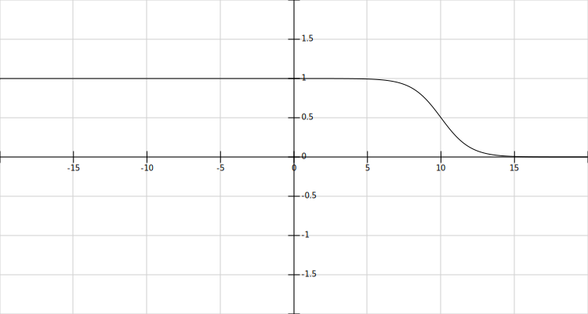


Si bien esta función no garantiza que se siempre seleccionen s individuos, de media si que selecciona s individuos, por lo que a la larga la población permanece estable.

El número de supervivientes debe ser fijado de acuerdo al número de hijos, ya que si sobreviven demasiados individuos la población explota en tamaño y si sobreviven pocos la población se termina extinguiendo. Para mantener la población estable el número de supervivientes debe ser el tamaño de la población entre el número de hijos.

Todo este proceso está implementado en la función `select_population()`.


### Selección de padres

Una vez seleccionada la población que va a reproducirse, esta se baraja y mediante una versión paralela del método [windows()](https://doc.rust-lang.org/std/primitive.slice.html#method.windows), que devuelve un iterador sobre las ventanas continuas de un vector, se van seleccionado grupos de tantos padres como se haya definido en el atributo `n_parents`. En cada grupo de padres se llama a la función `cross()`  tantas veces como el atributo `n_sons` diga. Esta función genera un hijo a partir del grupo de padres, y una vez generado el hijo se llama a `mutate()` que devolverá el hijo con la mutación. Cuando finaliza el recorrido de todos los grupos de padres, el resultado es una población de individuos completamente nuevos. Todo este proceso se realiza dentro de la función `new_generation()`.


### Operador de cruce

El operador de cruce es la función `cross()`. Esta función recibe un grupo de permutaciones que van a actuar de padres y un parámetro `genetic_mix`. Cada padre es dividido en un número de segmentos equivalente al número de padres multiplicado por  `genetic_mix`.  Luego se compone un hijo seleccionando aleatoriamente el mismo número de segmentos de cada padre. 

Durante este proceso se verifica que no se añadan números repetidos, en caso de encontrarse uno se introduce en su lugar `None`. Luego la función `fix_permutation()` se encarga de sustituir aleatoriamente esos valores `None` por los números que falten.


### Operador de mutación

La función `mutate()`  recibe dos parámetros, la probabilidad de que ocurra una mutación y el máximo número de mutaciones que pueden ocurrir. Con ellos decide si el individuo va a ser mutado y cuanto va a serlo. Si la permutación es seleccionada para ser mutada entonces se genera un numero aleatorio entre uno  y el número máximo de mutaciones. Después utiliza ese número como argumento del método [partial_shuffle()](https://docs.rs/rand/0.8.3/rand/seq/trait.SliceRandom.html#tymethod.partial_shuffle) que aleatoriamente intercambia de lugar tantos elementos como se le diga.


### Ejecución del algoritmo genético

El algoritmo primero genera una población inicial de permutaciones usando una de las funciones de generación. Después entra en un bucle que se repite tantas veces como generaciones se hayan fijado. Dentro de ese bucle se realizan las siguientes acciones:

* Se evalúa la población usando la función de evaluación seleccionada.
* La población evaluada se ordena por coste.
* Si el coste mas bajo es inferior al menor coste encontrado hasta el momento, se guarda dicho costo junto con su permutación.
* Cada 50 generaciones se guarda la generación actual junto a la mejor solución hasta el momento. Esto se realiza para facilitar la creación de gráficas de visualización del algoritmo.
* Se seleccionan las permutaciones que van a poder reproducirse.
* Se barajan dichas permutaciones para que dejen de estar ordenadas y se cruzan entre ellas dando lugar a una generación completamente nueva que sustituye a la anterior.
* El bucle se ejecuta de nuevo con la nueva generación.


## Comparativas y resultados

En esta sección se han realizado una serie de graficas para ver como cada parámetro afecta al resultado final. El eje Y representa el coste y el eje X el valor del parámetro de entrada con el que se está experimentando. La linea de la gráfica es una curva bezier generada a partir de los puntos. Se han tomado 20, 10 o 5 muestras de cada parámetro dependiendo del tiempo que llevase la ejecución del algoritmo.

Salvo que se especifique lo contrario,  los parámetros de entrada para generar las gráficas han sido: 

* función de evaluación: naive

* generador de población: random_population
* generaciones: 100

* tamaño de población: 100

* número de supervivientes: 50

* número de padres: 2

* número de hijos: 2

* probabilidad de mutación: 0.3

* mutaciones máximas: 2
* mezcla genética: 1


### Generaciones

#### Algoritmo genético estándar

Para esta gráfica se ha ejecutado el algoritmo durante 10000 generaciones. Se puede apreciar como pasadas las ~4000 generaciones el coste medio casi no desciende.

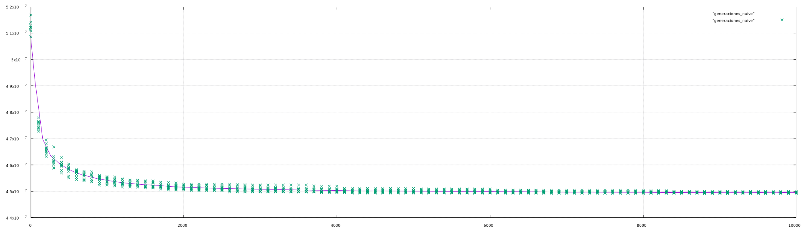


#### Variante baldwiniana

Esta variante se ha ejecutado durante 1000 generaciones. Se puede ver como el coste medio desciende conforme avanzan las generaciones. Seria interesante haber tomado mas muestras durante mas generaciones, pero la variante baldwinana es demasiado lenta.

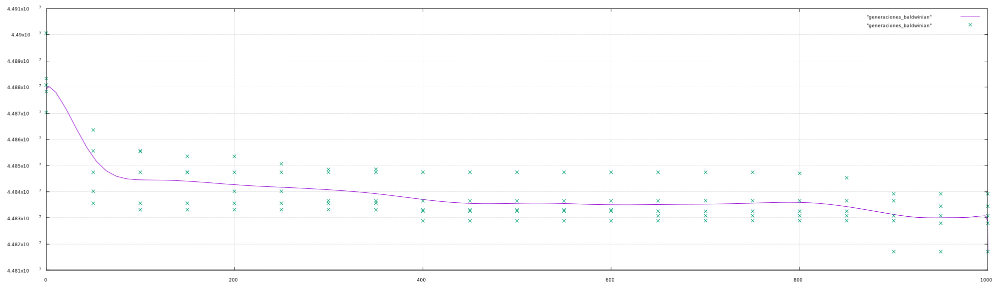


#### Variante lamarckiana

Esta variante es mas rápida que la baldwiniana, lo que me ha permitido tomar 10 muestras en lugar de 5, aunque habria sido interesante llegar al menos a las 5000 generaciones en lugar de las 1000 que aparecen en la gráfica.


#### Comparación

Si se afina la vista, en esta comparación se puede apreciar como la variante lamarckiana ofrece resultados ligeramente mejores que la baldwiniana mientras que la estándar es claramente la peor de todas.

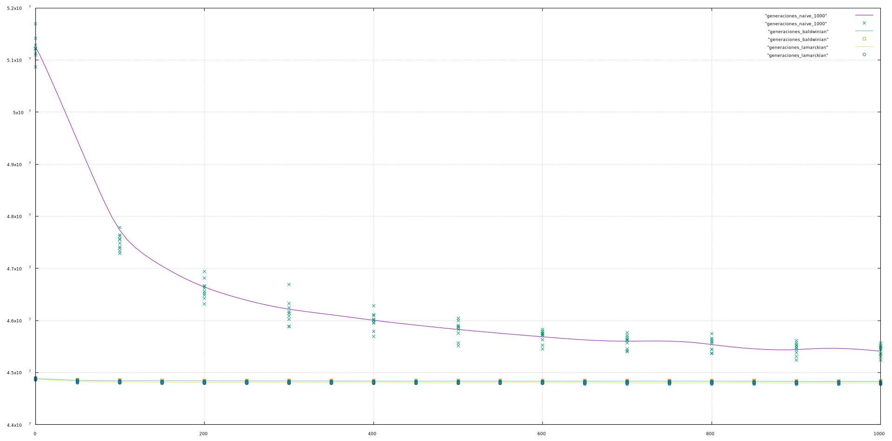


### Población

#### Algoritmo genético estándar

En la siguiente gráfica se puede ver en la variante estándar, para 100 generaciones, los resultados no mejoran pasado un tamaño de población de ~250.


#### Variante baldwiniana

Aquí podemos ver como los resultados de la variante baldwiniana mejoran conforme aumenta el tamaño de población. Solo he podido llegar a un tamaño de población de 300 debido a la lentitud de esta variante. De la misma forma que antes habría sido interesante poder tomar mas datos.


#### Variante lamarckiana

Con esta variante he podido llegar a un tamaño de población de 500, también se puede apreciar que el descenso del coste mas estable que el caso anterior.

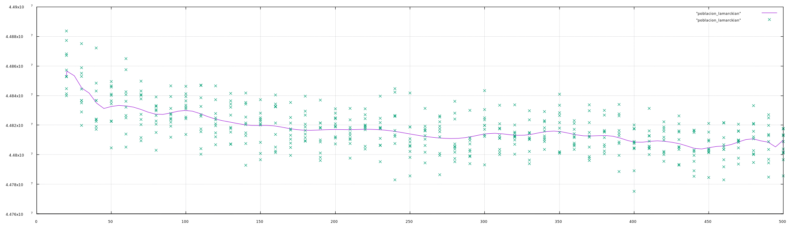


### Generador de población

#### Algoritmo genético estándar con `locally_optimized_population()`

En esta gráfica se puede apreciar como tras 10000 generaciones el algoritmo genético estándar es incapaz de mejorar la población inicial. Esto es debido a que el algoritmo greedy utilizado en `locally_optimized_population()` ha encontrado una solución muy buena para esta variante.

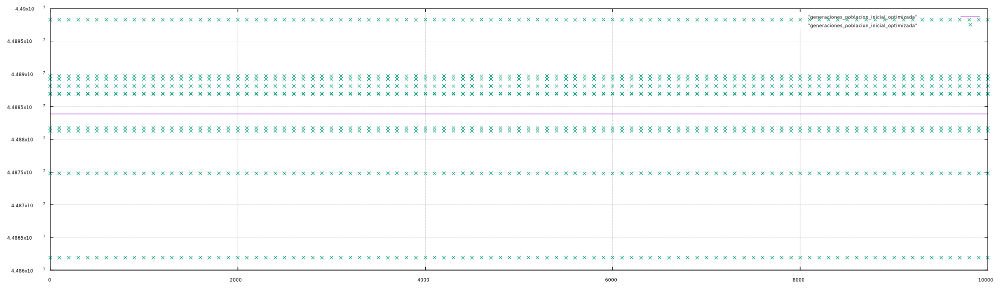


#### Comparación con `random_population()`

Comparando `locally_optimized_population()` con `random_population()` se puede ver que las soluciones de `locally_optimized_population()` son mejores. Aunque en ningún momento de las 10000 generaciones se produce un descenso del coste, pues el algoritmo greedy obtiene mejores resultados que la variante estándar.

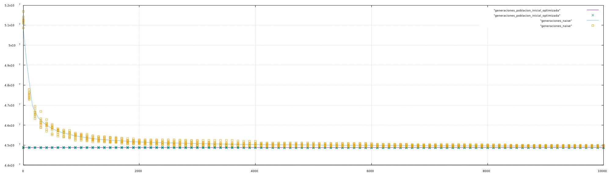


### Número de padres

En esta gráfica se puede apreciar como cuantas mas permutaciones se usan para generar un hijo, peor termina siendo el resultado:

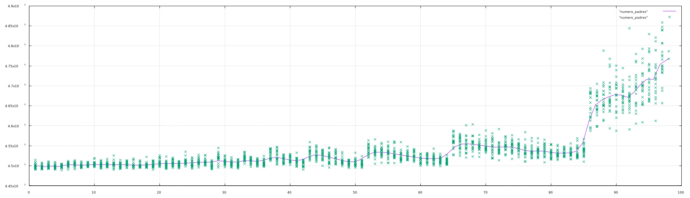


### Número de supervivientes e hijos

Para generar esta gráfica se ha tomado una población de tamaño 1000 y se ha ido disminuyendo el numero de supervivientes conforme se ha ido aumentando el numero de hijos. En concreto los supervivientes eran 1000/hijos. Se puede apreciar que estos cambios no tienen ningún efecto en la solución

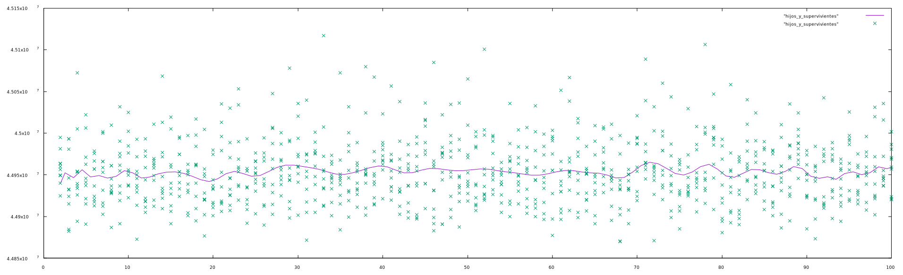


### Probabilidad de mutación y máximo numero de mutaciones

Para estas gráficas la probabilidad de mutación está expresada sobre 100 en lugar de sobre 1.

#### Probabilidad de mutación con una mutación máxima de 255

Podemos ver como una probabilidad del 0% da los peores resultados, en cuanto pasamos a 1% los resultados mejoran inmediatamente. A partir de ahí siguen mejorando progresivamente hasta que alrededor del 45% los resultados empiezan a empeorar de nuevo. La explicación es que con un tamaño de mutación máxima de 255, una permutación inicialmente buena que sea seleccionada para ser mutada puede cambiar demasiado.


#### Mutaciones máximas

En esta gráfica podemos ver como aumentar el número máximo de mutaciones termina empeorando los resultados.


#### Probabilidad de mutación con una mutación máxima de 2

Tras ver los resultados de la gráfica anterior decidí repetir la gráfica de la probabilidad, pero esta vez con una mutación máxima de 2 en lugar de 255. En este caso no aparece el empeoramiento de resultados que anteriormente veíamos a partir del 45%.

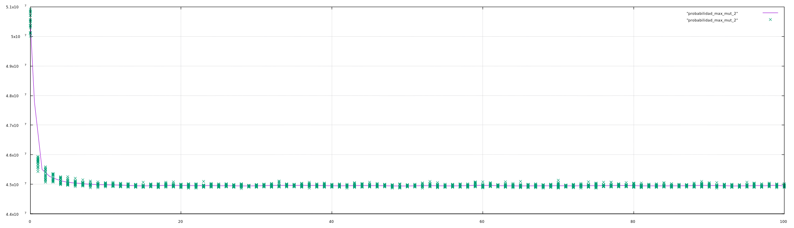


### Mezcla genética

En esta gráfica vemos como el parámetro mezcla genética no mejora ni empeora las soluciones.

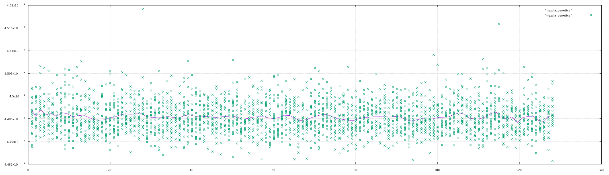


### Mejor solución

El mejor resultado fue obtenido en una versión temprana del código pero que usaba todos los mecanismos descritos aquí. Utilizando la variante lamarckiana con una población inicial aleatoria de tamaño 200,  una probabilidad de mutación de 0.2, una mutación máxima de 255, dos padres, dos hijos, 100 supervivientes y una mezcla genética de 1,  tras 838 generaciones se obtuvo una solución de coste equivalente a la mejor solución conocida: 44759294

La solución es la siguiente:

86, 145, 125, 88, 122, 4, 228, 179, 108, 103, 55, 137, 156, 160, 188, 167, 209, 38, 162, 169, 6, 192, 171, 199, 21, 186, 57, 113, 30, 196, 243, 13, 230, 213, 235, 127, 78, 47, 118, 142, 139, 201, 91, 69, 10, 216, 105, 130, 152, 99, 40, 222, 95, 52, 96, 191, 61, 25, 226, 50, 194, 252, 48, 254, 59, 165, 182, 1, 148, 93, 133, 116, 8, 16, 65, 84, 240, 239, 174, 44, 218, 27, 247, 220, 159, 82, 74, 205, 135, 249, 18, 35, 32, 63, 17, 0, 248, 149, 168, 195, 12, 19, 51, 212, 9, 187, 241, 163, 117, 233, 34, 81, 43, 129, 200, 214, 114, 244, 56, 123, 7, 193, 85, 58, 37, 64, 207, 158, 24, 146, 178, 66, 136, 100, 75, 2, 175, 26, 144, 14, 181, 112, 20, 111, 183, 45, 234, 202, 238, 172, 138, 36, 210, 106, 255, 23, 242, 83, 229, 31, 219, 119, 22, 46, 94, 29, 184, 217, 227, 250, 185, 143, 190, 98, 150, 5, 41, 147, 251, 198, 224, 223, 206, 151, 71, 134, 208, 166, 107, 33, 131, 73, 197, 49, 161, 54, 231, 67, 221, 90, 60, 253, 124, 121, 15, 39, 232, 92, 215, 237, 132, 110, 97, 246, 79, 11, 211, 104, 170, 89, 3, 62, 70, 245, 126, 225, 109, 180, 68, 189, 53, 80, 141, 236, 177, 42, 154, 157, 203, 76, 87, 176, 204, 164, 28, 115, 173, 128, 101, 72, 155, 153, 120, 77, 102, 140


## Posibles mejoras

Una posible mejora para el algoritmo genético sería utilizar otro algoritmo de optimización local, por ejemplo el algoritmo  3-opt, pero dado que cada iteración de 3-opt tiene complejidad cúbica, algoritmo se volvería extremadamente lento.


## Conclusiones

De las tres variantes implementadas la variante lamarckiana es la que mejores soluciones ofrece, aunque la baldwiniana se le queda cerca. Además según mis pruebas la variante lamarckiana es alrededor de 10 veces mas rápida que la baldwiniana. La variante estándar es la más rápida, pero como se ha visto [aquí](#Comparación con random_population()), sus soluciones son peores que las que consigue el algoritmo greedy.

Entorno al final del desarrollo de este práctica me planteé si podía mejorar la mejor solución conocida, pues la había obtenido con una ejecución bastante pequeña. Fue entonces cuando diseñé la función `optimized_population()` y ejecuté el algoritmo con los parámetros mas óptimos que conocía:

* función de evaluación: lamarckian
* generador de población: optimized_population
* generaciones: 5000

* tamaño de población: 500

* número de supervivientes: 250

* número de padres: 2

* número de hijos: 2

* probabilidad de mutación: 0.3

* mutaciones máximas: 2

* mezcla genética: 1

La ejecución del algoritmo duró alrededor de 10h, y al finalizar obtuve un resultado de 44775998. Un día después volví a ejecutarlo y esta vez obtuve un resultado de 44774130.  Ambas soluciones son muy buenas, pero se quedan a ~20000 puntos de la mejor solución. 

Estos resultados apuntan que pasado cierto umbral, la bondad de una solución depende de la suerte mas que de los parámetros de entrada del algoritmo genético.
