# Práctica 1 TID: Preparación de Datos

**Por: Arturo Cortés Sánchez**

### 1. Discretización

Antes de cargar accidentes.xls en knime he reemplazado los valores desconocidos por celdas vacías y he creado una nueva columna a la que he llamado gravedad. Dicha columna resulta de realizar el siguiente calculo de 3 x FATALITIES + 2 x INJURY_CRASH + PRPTYDMG_CRASH.

​	

a) 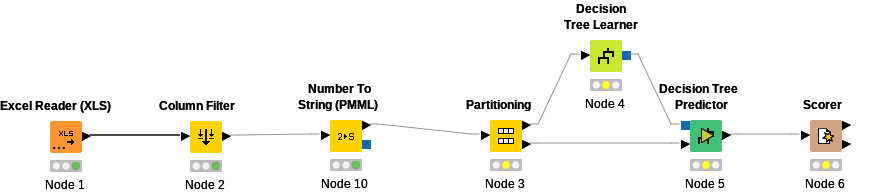

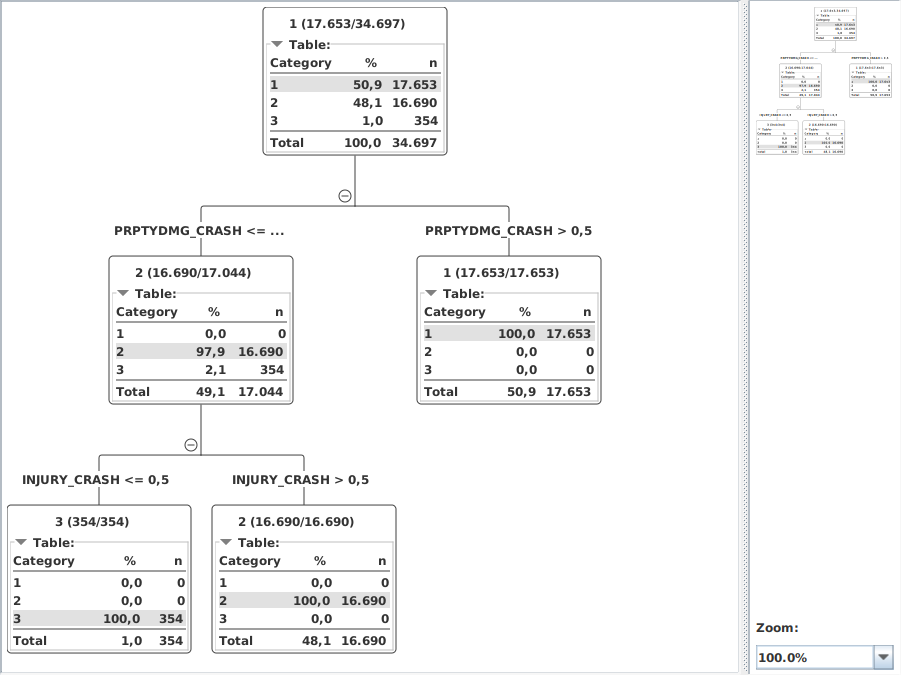

​	b)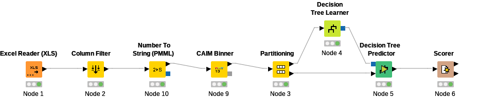

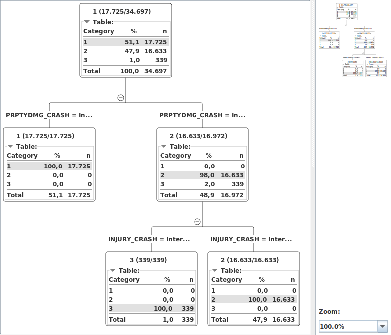

​	c)

* MONTH: Mes del año en el que ocurrió el accidente. Una posible categorización sería agruparlos en trimestres

* WEEKDAY: Día de la semana en el que ocurrió el accidente. Una posible categorización sería agruparlos en fin de semana y entre semana.

* HOUR:  Hora del día en el que ocurrió el accidente. Una posible categorización sería agruparlas en si es de dia o de noche.

* VEH_INVL: Numero de vehículos involucrados en el accidente.  Una posible categorización sería agruparlo en si el accidente ha involucrado o no a varios vehículos.

* NON_INVL: Numero de no motoristas involucrados en el accidente.  Una posible categorización sería agruparlo en si el accidente ha involucrado o no a varios no motoristas.

* LAND_USE: Población del área en la que ha ocurrido el accidente. Una posible categorización sería distinguir entre si es ciudad o pueblo.

* MAN_COL: Forma de colisionar. Una posible categorización sería ver si se ha colisionado con el entorno o con otro vehículo.

* REL_JCT: Relación con un cruce. Una posible categorización sería ver si el accidente ha ocurrido o no en un cruce.

* REL_RWY: Relación con la acera. Una posible categorización sería  sería ver si el accidente ha ocurrido o no sobre una acera.

* TRAF_WAY: Tipo de tráfico. Una posible categorización sería ver si la carretera es de doble sentido o no.

* NUM_LAN:  Numero de carriles. Una posible categorización sería ver si la carretera tiene mas de un carril o no.

* ALIGN: Alineamiento de la carretera. Una posible categorización sería ver si la carretera es curva o no.

* PROFILE: Perfil de la carretera . Una posible categorización sería clasificarla por rangos de inclinación.

* SUR_COND: Condición de la superficie de la carretera. Una posible categorización sería ver si la carretera estaba en mal estado o no.

* TRAF_CON: Dispositivo de control de trafico. Una posible categorización sería ver si había señales luminosas o no.

* SPD_LIM: Limite de velocidad. Una posible categorización sería dividir las posibles velocidades entre 0 y la máxima velocidad permitida en 4 tramos.

* LGHT_CON: Condiciones de luz. Una posible categorización sería ver si es de día o de noche.

* WEATHER: Condiciones climáticas. Una posible categorización serían distintos eventos climáticos que pueden afectar a la conducción. Por ejemplo lluvia, nieve o niebla.

* PED_ACC: Tipo de accidente de peatón o ciclista. Una posible categorización sería ver si  el accidente ha afectado a un peatón/ciclista, y si lo ha hecho ¿Cómo ha acabado? Indemne, contusión leve, rotura de hueso o muerte

* REGION: Región del país. Una posible categorización sería especificar el estado en el que ha ocurrido el accidente.

  

### 2. Valores perdidos

a)

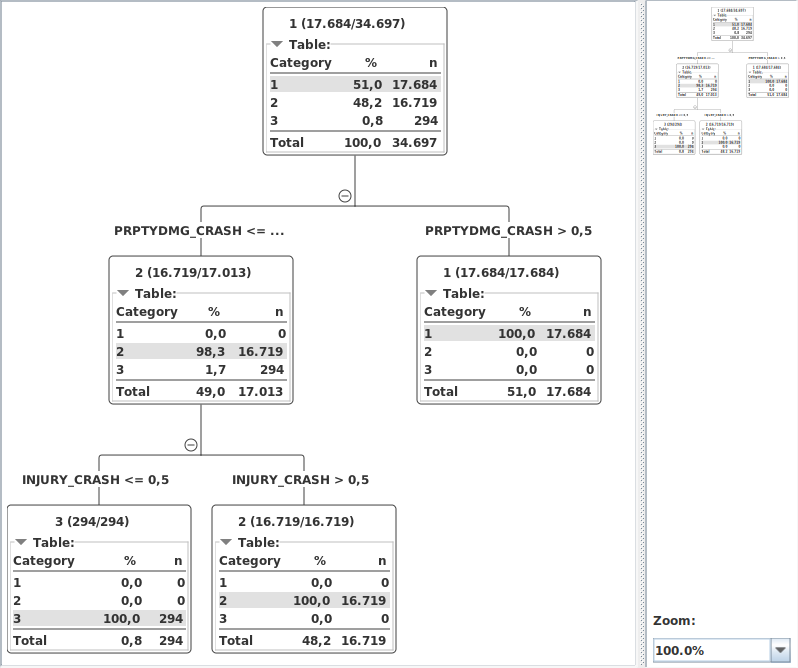

b)

c)

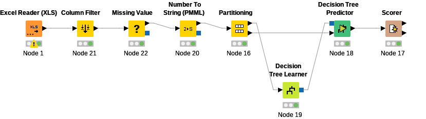

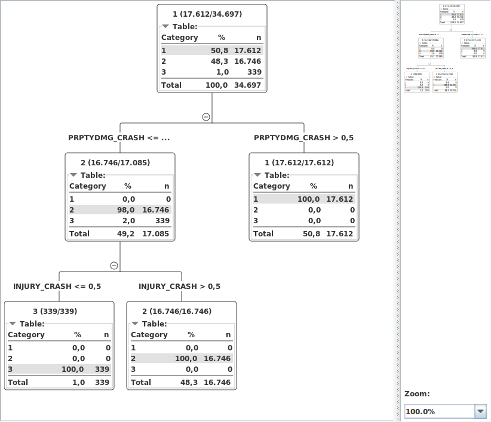

d)

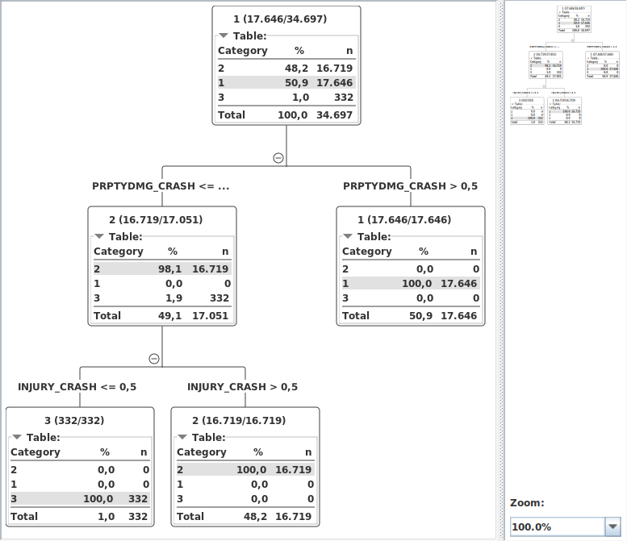

e)

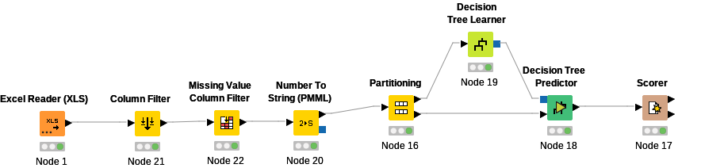

### 3. Selección de características

a)

b)

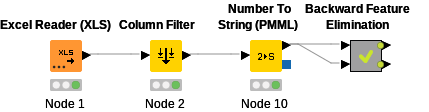

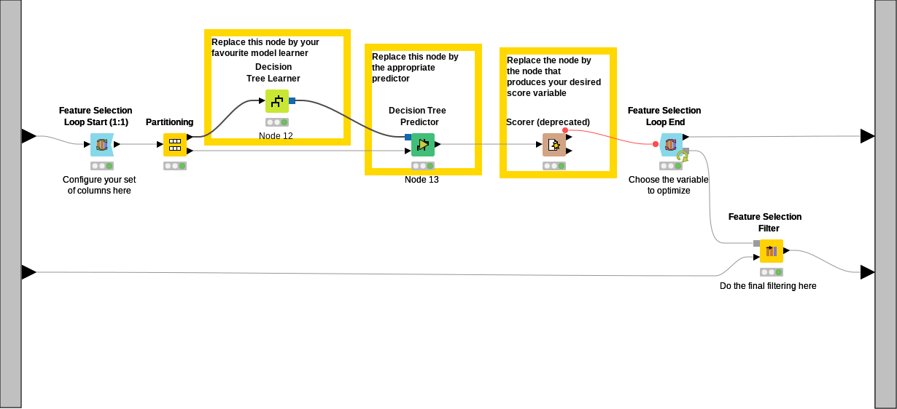

### 4. Selección de instancias

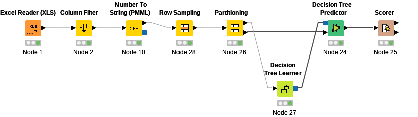

