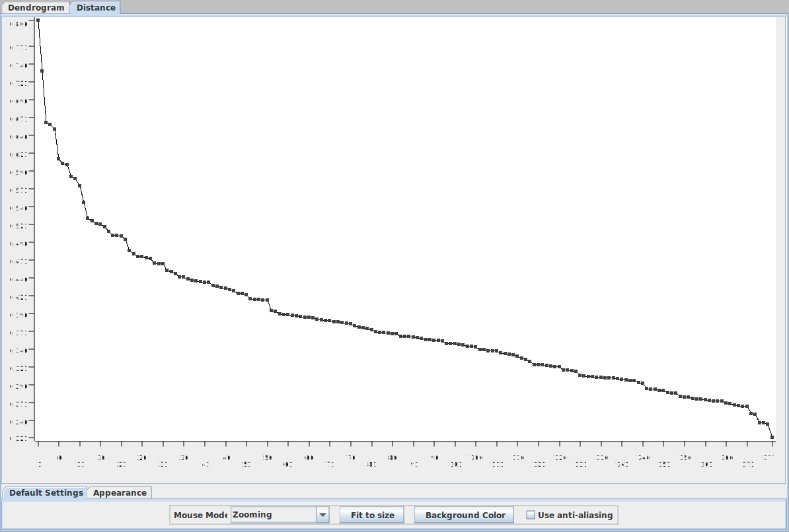
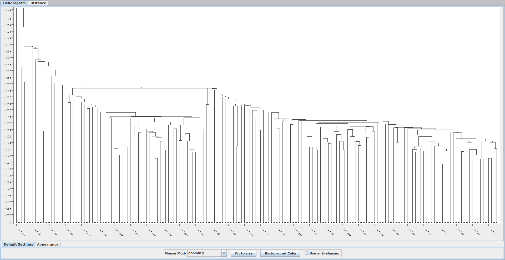
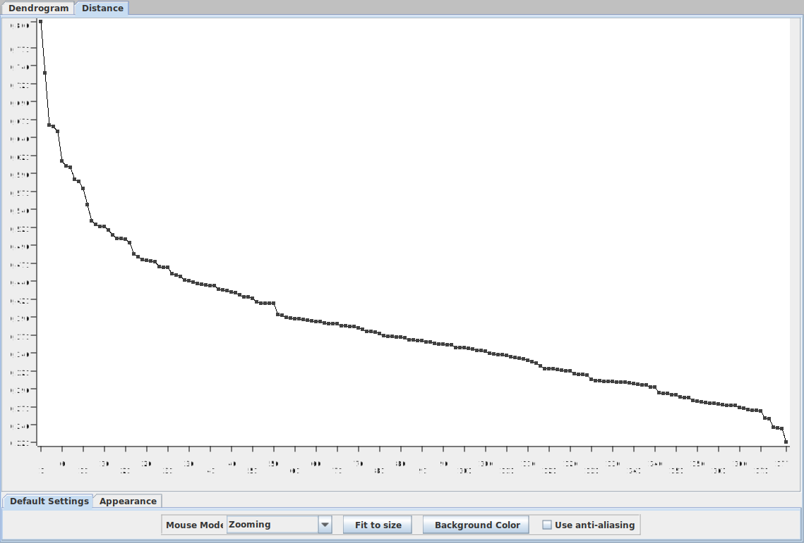
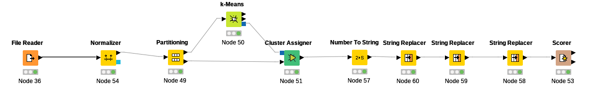
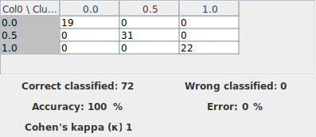

# Práctica 2: Clustering

**Por: Arturo Cortés Sánchez**

### 1. Realizar un algoritmo de clustering jerárquico para analizar en cuántos clusters diferentes podrı́amos agrupar los datos.

En el grafico vemos que podria dividirse en tres o cuatro clusters

### 3. Analiza la existencia de outliers y elimı́nalos si consideras que existe alguno. Repite el clustering jerárquico y vuelve a analizar el número de cluster a considerar.

He seleccionado como outlier las 14 primeras filas que aparecen en este gráfico. En concreto son las siguientes: Fila 121, fila 73, fila 69, fila 78, fila 95, fila 59, fila 96, fila 110, fila 115, fila 158, fila 159, fila 71, fila 123

El gráfico no ha cambiado demasiado, por lo que sigue habiendo tres o cuatro clusteres.

### 3. Aplica el algoritmo k-medias al archivo del punto anterior con el número de clusters elegido. Compara cómo se distribuyen los clusters respecto a las clases de la primera columna.

He seleccionado tres clusteres para el k-medias

Y he obtenido el siguiente resultado

![matrix]./img/matrix.svg)

Posteriormente me he dado cuenta de que sin querer he normalizado las etiquetas, pero dado que son reconocibles no supone un problema

### 4. Aplica algún tipo de reducción de dimensionalidad que consideres oportuno (filtrando columnas, corre-lacción, análisis de componentes principales, etc...) y aplica el algoritmo k-medias para tres cluster. De nuevo, compara cómo se distribuyen los clusters respecto a las clases de la primera columna.

Introduciendo en el workflow un nodo de low variance filter con un umbral de 0.2, obtenemos el siguiente resultado:

### 5. Aplica el algoritmo DBSCAN utilizando el nodo contenido en la carpeta de weka al archivo original para varios parámetros de radio y puntos mı́nimos. Compara cómo se distribuyen los clusters respecto a la primera columna ¿Se pueden identificar los outliers?

Tras probar con distintas con distintas combinaciones me he quedado con un epsilon de 0.7 y un minpoints de 7. Con esta combinación los clusters se distribuyen igual que la primera columna, excepto porque incluye algunos valores marcados como noise. Estos valores son los outliers e incluyen todos los que inicialmente yo había marcado como tales, además de algunos otros.
