# Práctica 3: Clasificación

**Por: Arturo Cortés Sánchez**

Inicialmente usé libreoffice calc para añadir un par de columnas en las que los precios están convertidos a euros. Si el precio estaba en dolares, era multiplicado por 0,8 y si estaba en libras era multiplicado por 1,1. La intención era unificar los precios para facilitar el aprendizaje de los modelos, pero tras unas cuantas pruebas me he dado cuenta de que repercutía negativamente, así que las terminé eliminando.

* Bayes:

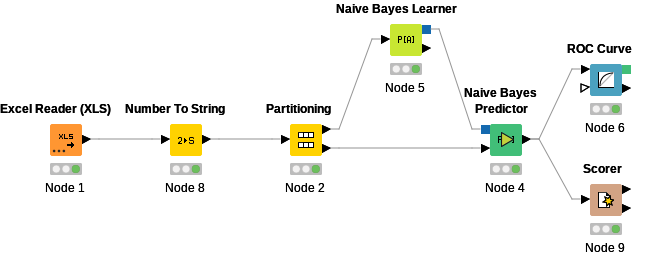

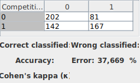

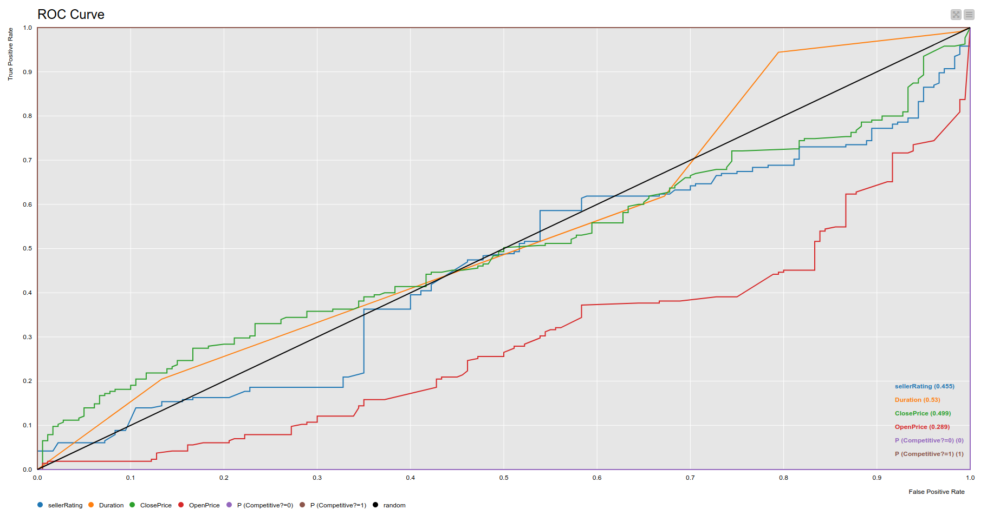

* Decision tree:

  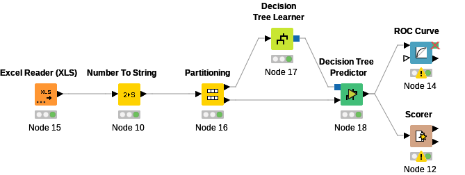

  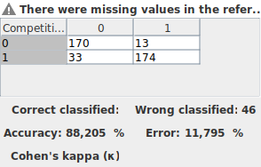

  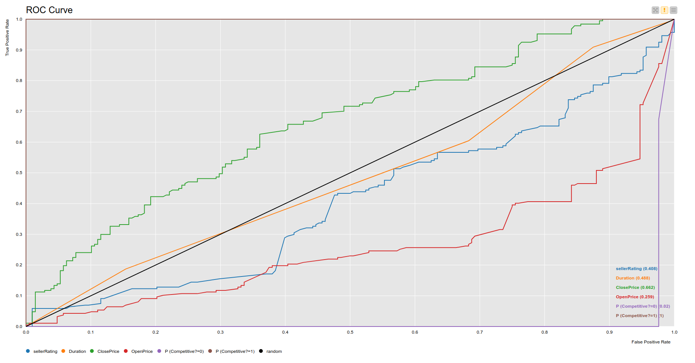

* SVM

  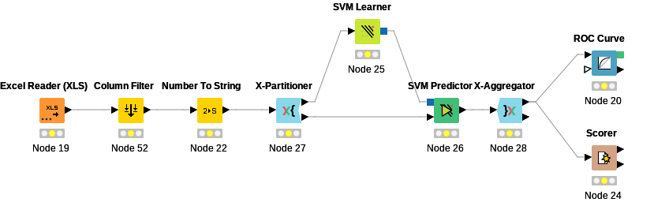

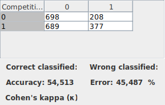

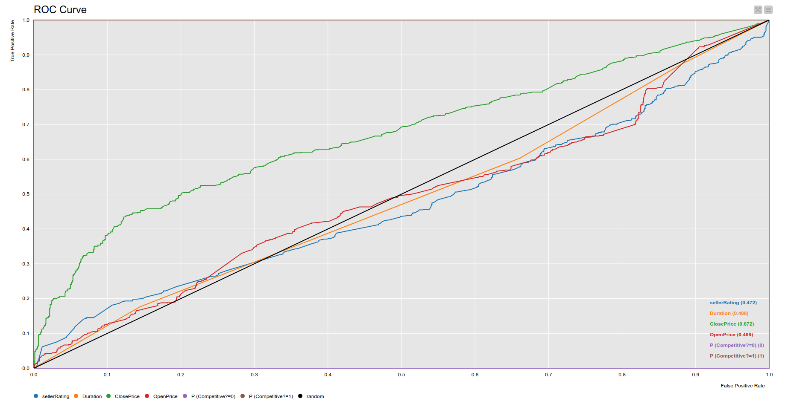

* K Nearest Neighbor:

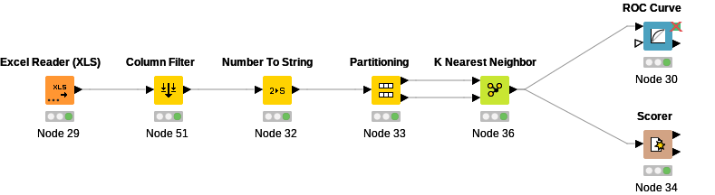

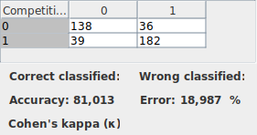

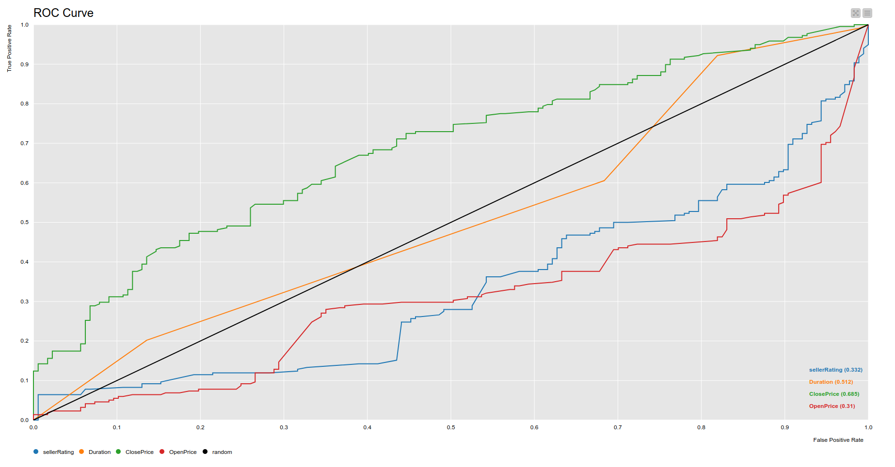

* Perceptrón multicapa:

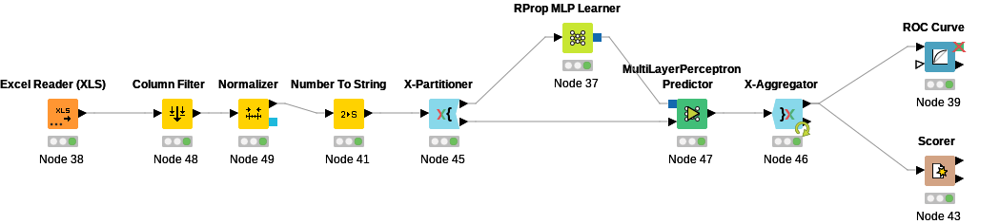

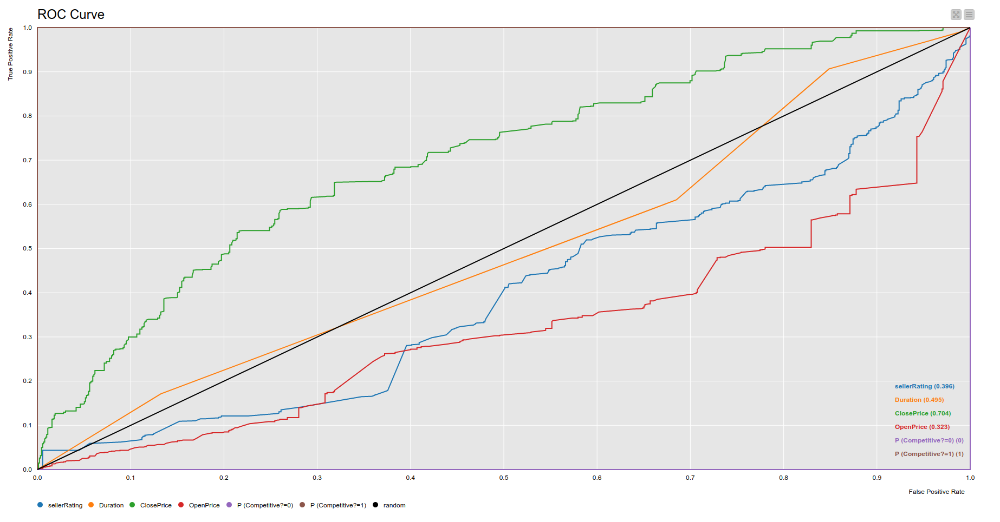

Todas las veces que he hecho uso del nodo partitioning he seleccionado 80/20, ya que he observado que da mejores resultados que la opción por defecto.

En el caso del perceptrón  multicapa he aumentado el numero de capas ocultas a 3 y el numero de iteraciones a 200, logrando así un resultado bastante bueno.

En la curva ROC de los modelos de bayes y SVM, se puede apreciar como el modelo no ofrece buenas predicciones, el segundo modelo es además el que mas errores comete, aunque eso puede que sea debido a que durante el entrenamiento alcanzó el número máximo de iteraciones. 

En el caso del resto de modelos son bastante buenos prediciendo el precio cierre, pero bastante malos prediciendo el resto de características. Esto podría ser debido a que características como la puntuación del vendedor o el precio de apertura repercuten inversamente a la hora de clasificar en base a la competitividad de una subasta. 

Si un vendedor quisiera que sus subastas fuesen competitivas, debería de tratar de colocar precios iniciales no demasiado altos y de alguna forma tratar que el precio de cierre sea alto. Si bien el vendedor tiene difícil hacer esto, la plataforma ebay puede alentar la competitividad de las subastas mostrando a los usuarios productos con un precio de apertura bajo y que aun no sean competitivos.

