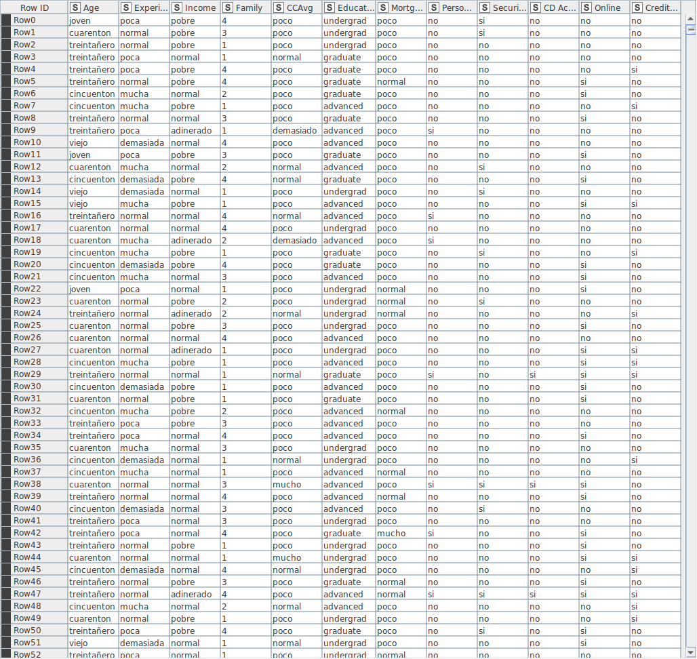
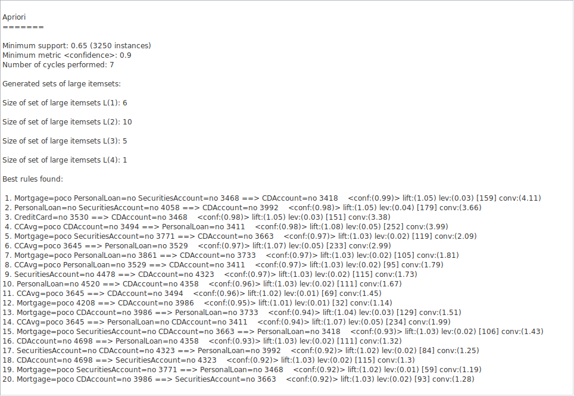
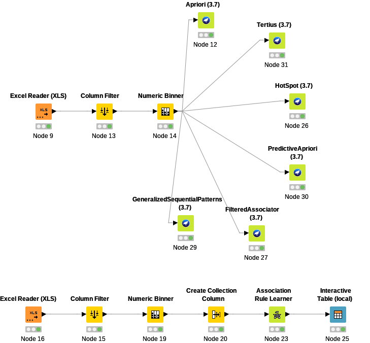
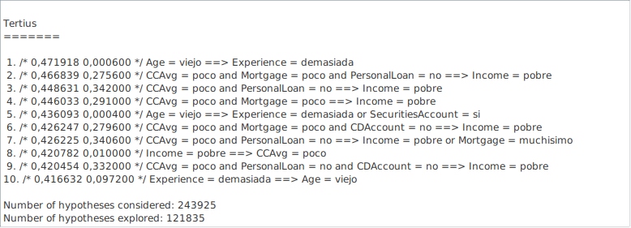
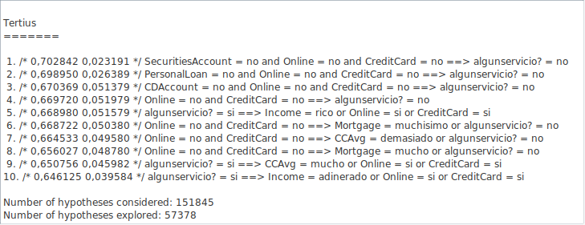

# Práctica 4: Asociación

**Por: Arturo Cortés Sánchez**

Lo primero que he hecho ha sido eliminar la columna zip code, ya que es la mas irrelevante de todas. A continuación usando el nodo numeric binner he discretizado los datos, quedando la tabla así:

A continuación he corrido el algoritmo apriori:

Desgraciadamente ninguna de las reglas generadas son negativas, así que pasé a probar otros algoritmos de asociación de weka, así como el nodo association rule learner:

Tras ejecutar todos estos nodos, solo el algoritmo tetrius, uno de los mas lentos, devolvió una regla positiva:

Si la persona tiene mas de 60 años, tiene mas de 30 años de experiencia o tiene una cuenta de valores.

Gracias al descubrimiento de esta regla, el banco puede decidir tratar de venderle servicios financieros a las personas de 60 o mas años.

Me ha sorprendido solo encontrar una regla positiva. Así que buscando algo mas general he creado una columna nueva en la que aparecerá si el cliente en cuestión tiene contratado algún servicio de interés para el banco.

Con esta nueva columna podemos volver a correr los algoritmos, y tetrius vuelve a mostrar algo interesante:

Los clientes han contratado algun servicio, si gastan mucho, o si usan banca online, o si ganan mucho dinero, o si tienen tarjeta de credito. Como esta utlima condición es suficiente para que algunservicio? sea verdadera, creo que la podemos descartar. Por tanto tendriamos que los clientes contratan servicios si tienen mucho dinero o si usan la banca online.